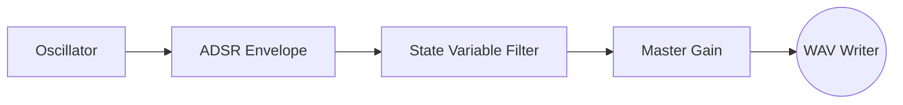

# synth

# F-Synth: A Retro Subtractive Synthesizer in Modern Fortran

> **Status:** Active Development (Phase 1: Infrastructure)  
> **Language:** Fortran 2018  
> **Build System:** fpm (Fortran Package Manager)

## Summary

**F-Synth** is a software-based subtractive synthesizer implemented entirely in Modern Fortran. 

The project treats audio synthesis not as a creative art, but as a **numerical simulation problem**. By leveraging Fortran's strong typing, array intrinsic operations, and numerical stability, F-Synth generates high-fidelity audio waveforms from first principles.

The goal is to produce a modular, dependency-free audio engine that writes mathematically perfect PCM data directly to disk, avoiding the abstraction layers of modern C++ or Python audio frameworks.

---

## System Architecture

F-Synth operates on a **Block Processing** architecture to balance memory usage and I/O performance.

### The Signal Chain

## Core Modules
##### Module	Responsibility	Status:

mod_types	Defines strict precision (real64, int16) constants.	 `Done`

mod_wav	Handles binary I/O and WAV header construction.	`Done`

mod_oscillator	Phase-accumulator based waveform generation (Sine, Saw, Square).	`Done`

mod_filter	Chamberlin State Variable Filter (Low/High/Band/Notch).	`In Progress`

mod_adsr	Finite State Machine for amplitude modulation.	 `Planned`

## Technical Details
1. Oscillator Design

We utilize a Phase Accumulator approach to ensure frequency stability and smooth transitions. $\phi_{n} = (\phi_{n-1} + \frac{f}{F_s}) \pmod 1$ This allows for continuous frequency modulation without phase discontinuity artifacts.

2. The Filter (Planned)

The filter implementation uses the Chamberlin State Variable formulation. This method is chosen for its numerical stability in fixed-step simulations and its ability to provide Lowpass, Highpass, and Bandpass outputs simultaneously from a single calculation step.

3. File I/O

The WAV writer (mod_wav) is a custom implementation compliant with the RIFF WAVE specification. It performs explicit quantization from `real(64) [-1.0, 1.0] to int(16) [-32767, 32767]`, with hard clipping protection to prevent integer overflow wrapping.

## Roadmap & Future Plans
Phase 1: The Foundation (Current)

    [x] Establish strict type definitions (mod_types).

    [x] Implement binary WAV header writer (mod_wav).

    [x] "Hello Beep": Generate a static Sine wave.

Phase 2: The Engine

    [ ] Implement mod_oscillator object-oriented structure.

    [ ] Add Sawtooth and Square waveforms.

    [ ] Implement Naive Anti-Aliasing (Band-limited steps).

Phase 3: The Sculpting

    [ ] Implement mod_adsr for amplitude shaping (Attack, Decay, Sustain, Release).

    [ ] Implement mod_filter (Low Pass Filter with Resonance).

Phase 4: The Composer

    [ ] Create a simple text parser to read "scores" from a file.
    Plaintext

    # Format: Note Start Duration
    A4 0.0 0.5
    C4 0.5 0.25

    [ ] Implement polyphony (mixing multiple oscillator instances).
